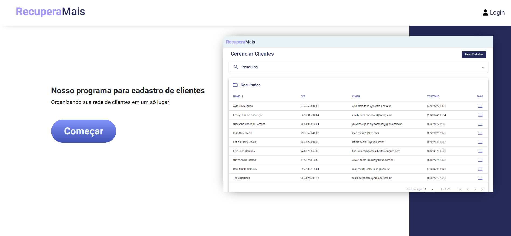
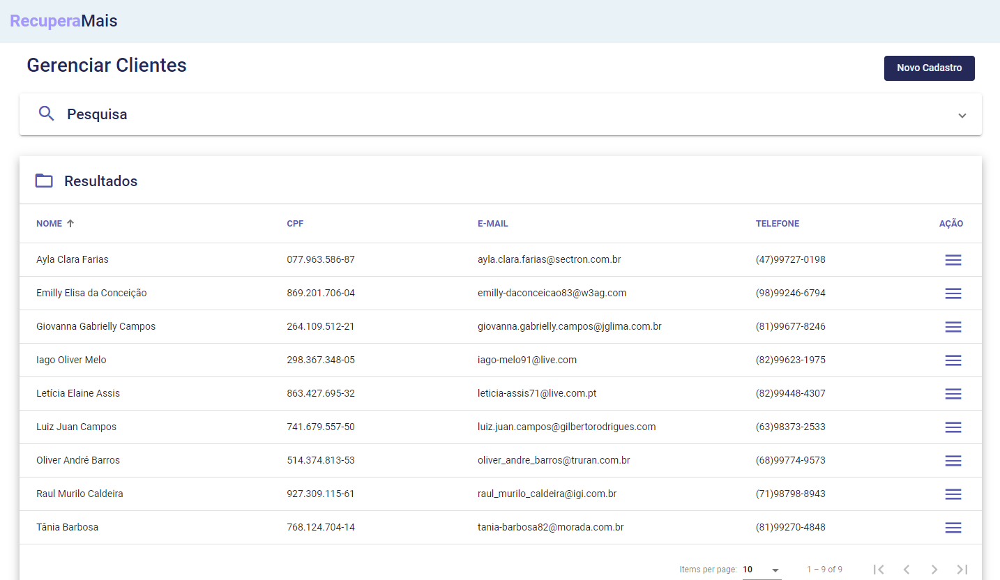
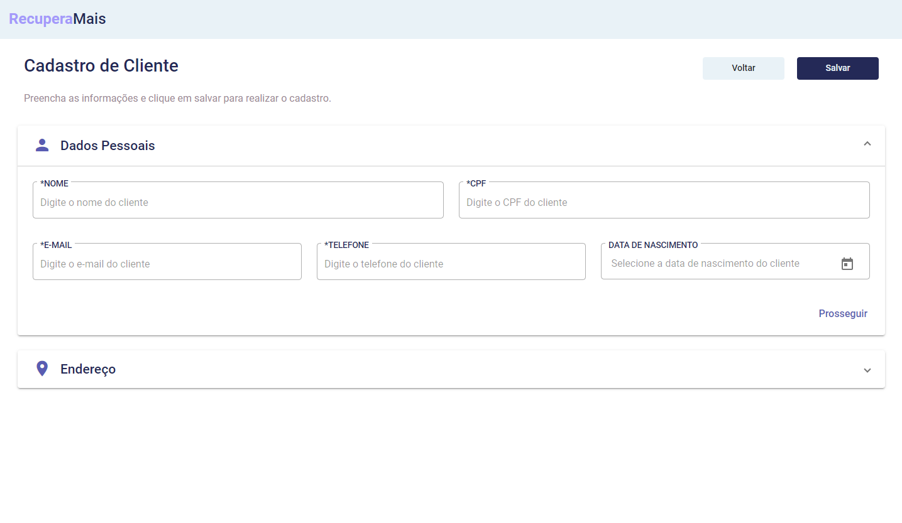
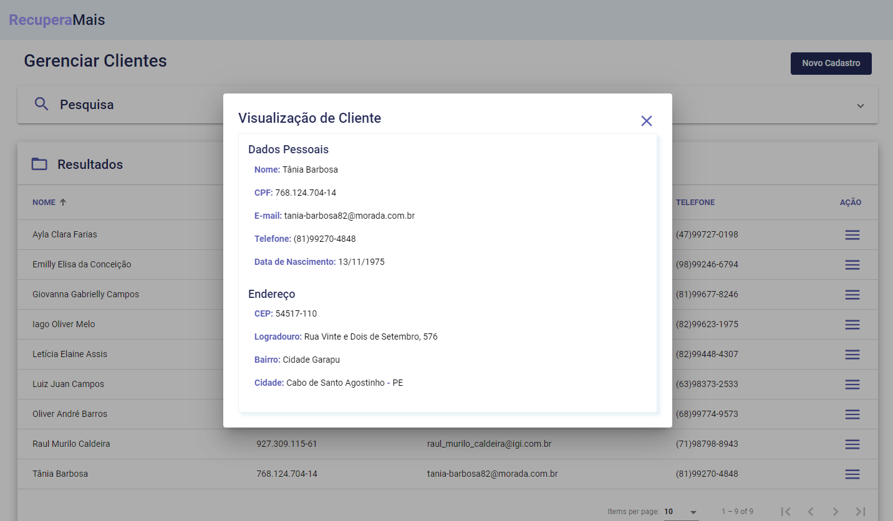

# RecuperaMais

RecuperaMais é uma aplicação web que permite realizar o gerenciamento de clientes de uma organização. Através dela, o usuário é capaz de executar as ações CRUD: criar novo cadastro
de cliente, visualizar informações cadastradas, atualizar e apagar dados.

[Link para a aplicação (domínio temporário)](http://recuperamais.s3-website-us-east-1.amazonaws.com)

## Tecnologias utilizadas

- Front-end: HTML, CSS, JavaScript e Angular;
- Back-end: Java e Spring Boot;
- Banco de dados MySQL para armazenamento;
- AWS para deploy.

Após desenvolver o código da aplicação, foi feito deploy para a nuvem AWS, sendo que foram utilizados os serviços:

- EC2 para criar a instância do back-end;
- S3 para criar um bucket para o front-end;
- RDS para a implementação do banco de dados em nuvem.

## Imagens da aplicação

